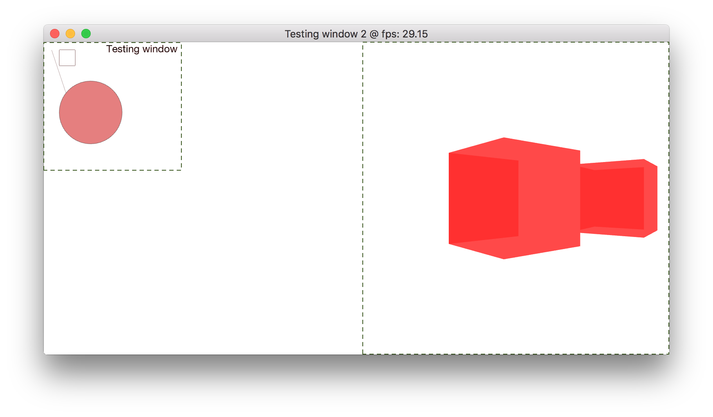

# Graphics API

The intent of this project is to make a cross-platform graphics API with low dependencies.

Dependencies are:
 * OpenGL installed on the system
 * GLFW, GLM, RapidJSON and SOIL come included as static libraries
 * CMAKE 2.8 at least

As of now it compiles only on Mac. The capabilities are:
 * Creation and management of windows in an object-oriented fashion
 	* there is currently a bug when using more than 1 window

 *  Tree structure of views. Rendering logic using the properties of this graph to minimise number of renders.
 *  Each view provides its own canvas to render on. This canvas is stored as a texture that the parent view uses to render itself and its children.
 *  Planning to implement throttling depending on user activity. I.e. mouse not moving and keyboard inactive -> Reduce framerate.
 *  Support for any user event (window resize, mouse move, mouse click, mouse scroll, keyboard and drag & drop).
 *  Text rendering.
 *  Last time I was implementing a drawing class for basic shapes.


The project structure is the following (follows more or less the structure of Blender):

```
├── cmake
├── cmake-build-debug
├── doc
├── extern		    	Statically linked libraries
│   └── Catch			Library for unit testing
├── graphics			Contains source code and other subdirectories of the main project
│   ├── cmake
│   ├── extern
│   │   ├── SOIL		Library for opening and saving different image formats
│   │   ├── glfw-3.2.1	Library for basic window handling and interface to OpenGL
│   │   ├── glm			Library for linear algebra
│   │   └── rapidjson	Library for reading JSON files
│   ├── learning
│   ├── logs
│   └── resources		Statically linked libraries
│       ├── JSON		JSON setup files
│       ├── fonts		Fonts for rendering
│       └── shaders		Shader files
└── PDESolver			A subproject that I was working on
```

There are a number of things that are done wrong currently, mainly because this was a non-serious project to learn about making GUIs. One of the main wrong thing is that the object files are currently installed in ```cmake-build-debug``` instead of in a fixed directory within the OS, so you must run the compiled file from the directory where it lives else it won't be able to locate all resources.

An example of a test app (the green dotted boxes are drawn afterwards to indicate the bounds of the views)(the content looks a bit boring, but it was a quick way to test that all functionality worked):


